# HELM Chart & Kubernetes Deployment for MERN Application

This project demonstrates the creation of Kubernetes deployment files and HELM charts for a MERN (MongoDB, Express.js, React.js, Node.js) stack application, along with Jenkins CI/CD pipeline automation.

## Project Overview

In this assignment, we are tasked with:
- Developing Kubernetes deployment files for both frontend and backend components
- Creating a HELM chart to streamline the deployment process
- Writing Jenkins Groovy code to automate the build and deployment process
- Ensuring seamless deployment, scalability, and efficient CI/CD pipeline

## Application Used

Instead of the originally suggested repositories, we have used **ShopNow** application.

**Forked Repository:** https://github.com/aryanm12/shopNow

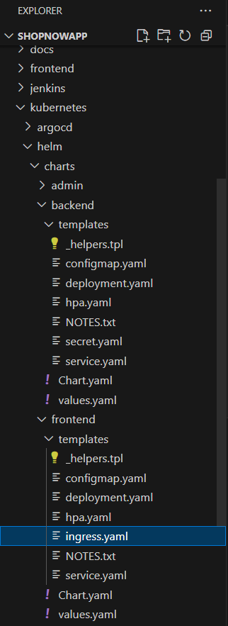

---

## Architecture Overview

```
MERN Application with Kubernetes & HELM
├── Frontend (React.js)
│   ├── Docker Container
│   ├── Kubernetes Deployment
│   ├── Service Configuration
│   └── Ingress Rules
├── Backend Services
│   ├── Node.js/Express API
│   ├── Docker Container
│   ├── Kubernetes Deployment
│   ├── Service Configuration
│   └── Database Connection
├── Database (MongoDB)
│   ├── Persistent Volume Claims
│   └── StatefulSet Configuration
├── HELM Chart
│   ├── Templates Directory
│   │   ├── Deployment Templates
│   │   ├── Service Templates
│   │   └── Ingress Templates
│   ├── Values.yaml
│   └── Chart.yaml
└── CI/CD Pipeline (Jenkins)
    ├── Source Code Management
    ├── Build Stage
    ├── Test Stage
    ├── Docker Build & Push
    ├── HELM Package
    └── Kubernetes Deploy
```

## Deployment Flow

1. **Code Commit**: Developer pushes code to Git repository
2. **Jenkins Trigger**: Webhook triggers Jenkins pipeline automatically
3. **Build & Test**: Application components are built and tested
4. **Docker Images**: Container images are created and pushed to registry
5. **HELM Package**: Application is packaged using HELM charts
6. **Kubernetes Deploy**: HELM deploys application to Kubernetes cluster
7. **Service Discovery**: Kubernetes services enable component communication
8. **Load Balancing**: Traffic is distributed across multiple pods
9. **Monitoring**: Deployment status and application health are monitored

---

## Kubernetes Deployment

### Backend Deployment

The backend component is deployed using Kubernetes deployment configurations that ensure:
- Scalability and high availability
- Proper resource allocation
- Service discovery and networking

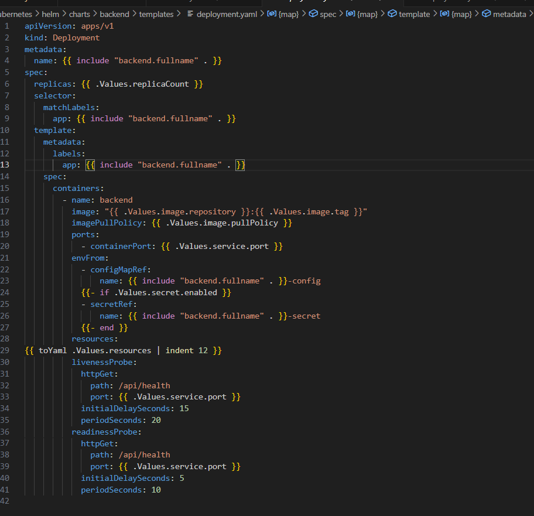
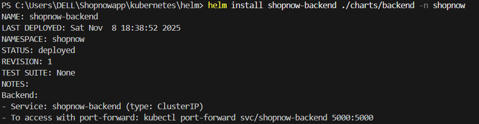

### Frontend Deployment

The frontend React application is containerized and deployed with:
- Nginx reverse proxy configuration
- Static file serving optimization
- Load balancing capabilities

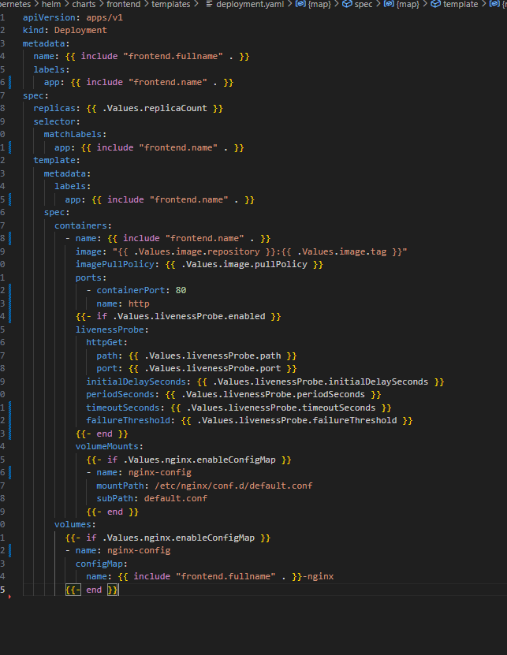
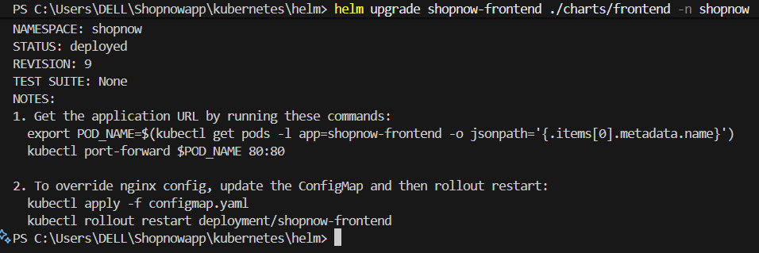

---

## Git Repository Management

Proper version control and repository management for the project:

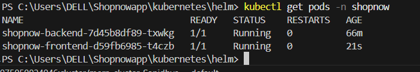

---

## CI/CD Pipeline with Jenkins

Automated build and deployment pipeline using Jenkins with:
- Automated testing and building
- Docker image creation and pushing
- Kubernetes deployment automation
- Pipeline monitoring and notifications

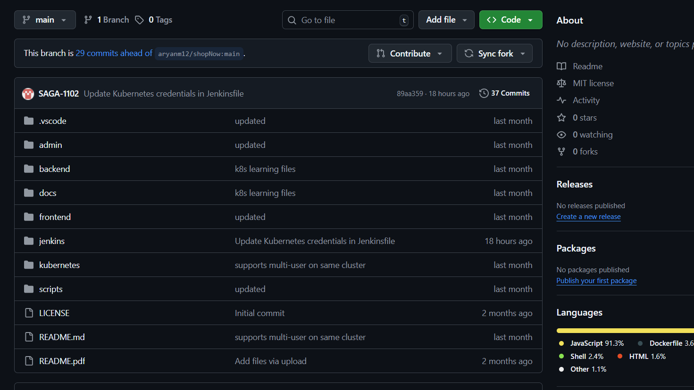
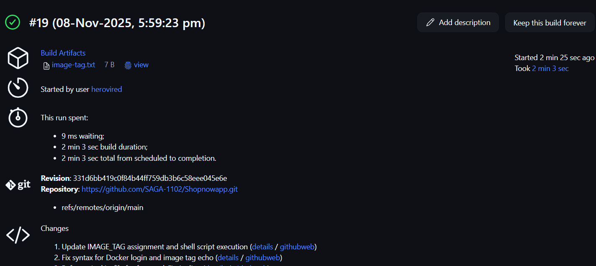
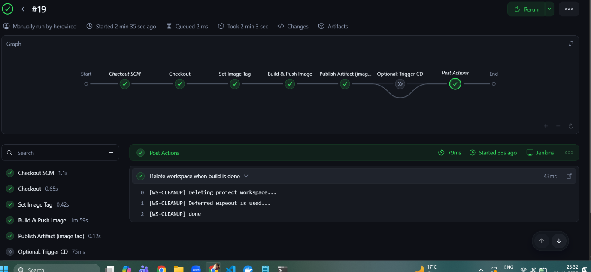

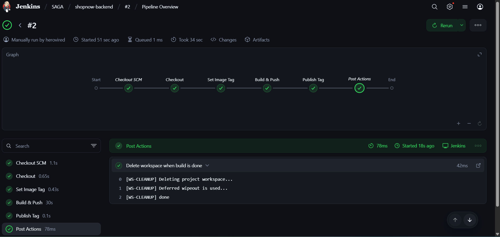

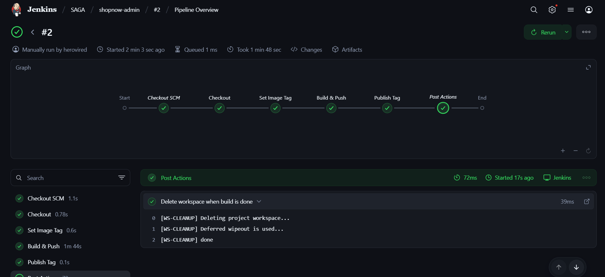

---

## Technologies Used

- **Kubernetes**: Container orchestration platform
- **HELM**: Package manager for Kubernetes
- **Jenkins**: CI/CD automation server
- **Docker**: Containerization platform
- **MERN Stack**: MongoDB, Express.js, React.js, Node.js
- **Git**: Version control system

## Key Features

✅ **Kubernetes Deployments**: Scalable frontend and backend deployments  
✅ **HELM Charts**: Streamlined deployment and configuration management  
✅ **Jenkins Pipeline**: Automated CI/CD with Groovy scripting  
✅ **Docker Integration**: Containerized application components  
✅ **Service Discovery**: Kubernetes native networking  
✅ **Load Balancing**: High availability and traffic distribution  
✅ **Monitoring**: Pipeline and deployment monitoring  


## Challenges and Solutions

- **Container Orchestration**: Implemented Kubernetes for scalable deployment
- **Configuration Management**: Used HELM charts for templated deployments
- **Automation**: Jenkins pipeline for consistent CI/CD process
- **Monitoring**: Integrated logging and monitoring for production readiness

This project demonstrates a complete DevOps workflow for MERN stack applications using modern container orchestration and automation tools.